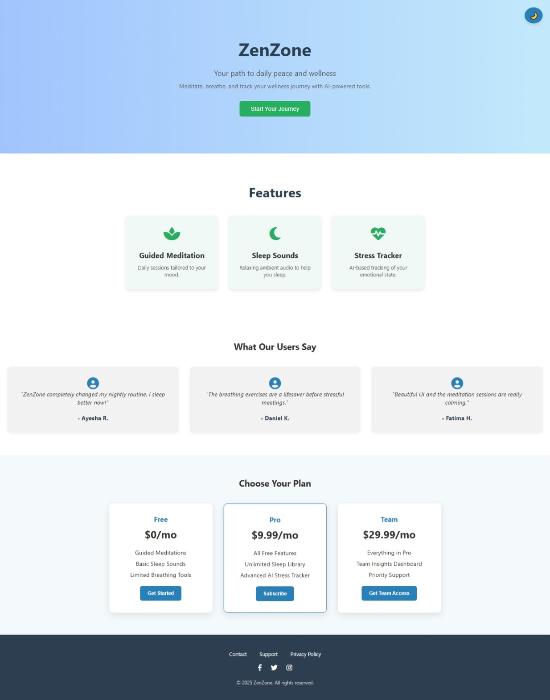
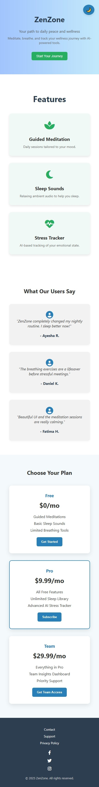

# ZenZone – Responsive Landing Page 🌿

A modern, responsive one-page landing site for a fictional SaaS wellness product called *ZenZone* — offering guided meditation, sleep sounds, and AI-powered stress tracking.

## 🔗 Live Demo

👉 [View Website](https://muhammad-salman123.github.io/ZenZone-elevvo-task)

## 📂 Features

- 🌈 Hero section with title, tagline & CTA button
- 🧘‍♂ Feature cards: Meditation, Sleep, Stress Tracker
- 💬 User testimonials in grid layout
- 💸 Pricing cards (Free, Pro, Team)
- 👣 Footer with social media and contact links
- 📱 Fully responsive for all screen sizes
- ✨ Font Awesome icons

## 📷 Screenshots

### 💻 Desktop View

### 📱 Mobile View

## 🛠 Built With

- HTML5
- CSS3 (Flexbox + Grid)
- JavaScript
- Font Awesome (CDN)

## 📌 Author

*Muhammad Salman*  
💼 [LinkedIn Profile](https://www.linkedin.com/in/muhammad-salman-6630152a9)  
📫 Email: msalmank1131@gmail.com

---
